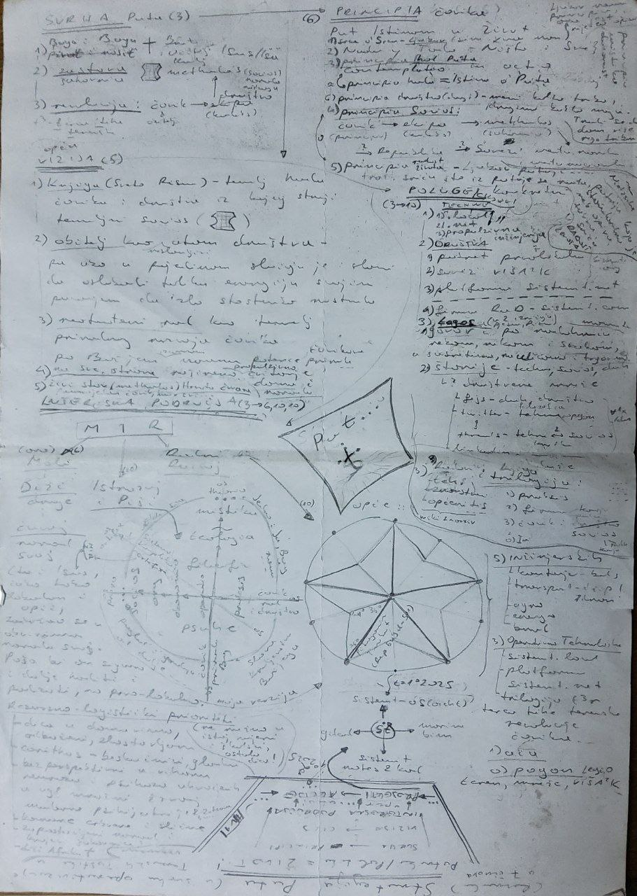

Ovo je osobna strategija koju je osnivač prije godinu dana napisao za sebe te stoga sadržava specifični oblik izražavanja ...  

Osobna je i **članovima nije obvezujuća**, ali da se zna kako dišu oni koji grade i bez novca, slave ili priznanja, dok te društvo karakterizira s podsmijehom ili žaljenjem kao 'propaloga' ...    

_Bogu hvala i slava na svemu !_

## 0. Metoda razrade
Strategija se razrađuje u pet činova:  
> **SVRHA** -> **PRINCIPI**  
> **VIZIJA** -> **CILJEVI**  
> **INTERESNA PODRUČJA**  

Interesna Područja dalje generiraju [_operatio_](/operatio): konkretne projekte i akcije.  

## 1. Svrha (3)
1. Bogu
2. narodu
3. revoluciji

## 2. Principia (6)
Put Istinom u Život ...

1. **srce o'Srca** - Ljubav (_sine qua non_) - tehnički nije princip pošto Ljubav jednostavno jest i time daje Formu formama ostalih principa
2. **principa mistika** - Ništa i Sve, _nada y Todo_
3. **principia hoda** - _contemplatio in actio_, moli hodajući. Naša Istina se događa na Putu ...
4. **principia radosti života** - Ljubav patnje ...
     ne traži sreću koja bježi od tame i patnje ovoga svita nego onu koja se rađa iz nje. Patnja je nezaobilazni standard, tražimo sreću koja je makar kruni smislom ... (nadahnuto Nietzsche-om)
5. **principia društvo** - meni koliko treba, drugima koliko mogu. Trudi se raditi i rasti tako da možeš više dati nego što imaš potrebe primiti.
6. **principia socios** - čovik (_principia_) -> ekipa/tvrtka (_kodeks_) -> šahovnica (_methodos_, međulokalno) -> ? Republika/nacija -> ? Savezi međunarodni i/ili međunacionalni

## 3. Vizija (5)
1. **Knjiga** (Sveto Pismo) - temelj hoda čovika i društva iz kojeg struji temeljni socios
2. **obitelj** - kao atom društva - pa ako u pojedinom slučaju je i slome da oslobodi toliku energiju svojim pucanjem da zlo stostruko nastrada
3. **neotuđeni rad** - kao temelj prirodnog razvoja čovika po Božjem izvornom naumu potence čovjekove prirode
4. **domovina** - na sve strane propulzivno cvjetanje doma i naroda
5. **narod** - živi stav (methodos) Hrvata kao čuvara

## 4. Ciljevi (3 -> 10)
Deset poluga u tri osi: techne, socios i logos.  
### Techne
1. sistemt.local
2. sistemt.net
3. propulzivna inžinjerija
### Socios
4. pokret prvolokalna (~sistemt.org)
5. savez VIŠA2K (~ sistemt.org/sistemt.net)
6. kapitalna platforma (~sistemt.net)
7. firme RaDa - (~sistemt.com)
### Logos
8. govori po nadahnuću nekom, nikom i svakom u susretima, na ulicama i trgovima
9. storije - techne, socios i duhovne
10. radovi tehnički, znanstveni i općeniti te knjiga trilogia

## 5. Interesna Područja ( 3 -> 6, 10, 10)
Sažeta akronimom **MIR** , varijacija na drevni _moli i radi_.

### Moli - Mir
Ukratko: 'proći ovim svijetom čineći dobro ne tražeći uslugu zauzvrat.'

Resursno-logistički prioriteti:
- dica u domovima, odbačeni, zlostavljani
- beskućnici i gladni
- besperspektivne životne situacije ljudi osobito onih u vihoru neuroza i psihoza uhvaćenih u uglavnom mračni žrvanj modernih institucija, naročito psihijatrijskih ustanova
- komune
- zapostavljeni narod i krajevi šahovnice
- globalno pružanje radno potentne pomoći, naročito Afrika

### Istražuj - mIr
Deset područja u tri dimenzije:
- os prakse: praksis -> operatio -> ekonomia -> organizatio -> socios
- os teorije: psyche -> filozofia -> teologia -> mistika
- os stvaranja: artifex/sistema kompleksa

### Radi i Razvijaj - miR
- inžinjerska
1. kontenjer-boks
2. transport - džip, dron
3. agro
4. energo
5. brod
- operativno-tehnološka
6. sistemt.local
7. sistemt.net
  8. trilogia t3r
  9. _aia_ - terca, nesto kao AI
 10. **pogon** (legio) - teren, mreže, VIŠA2K

 
 
---

## Skica

